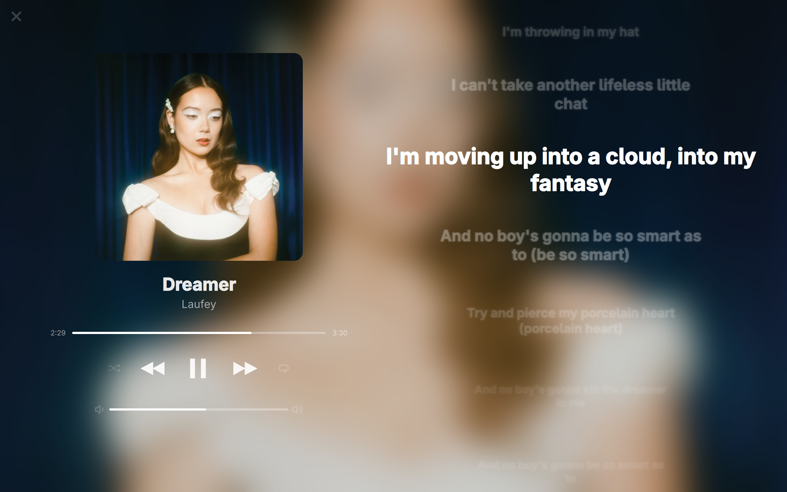
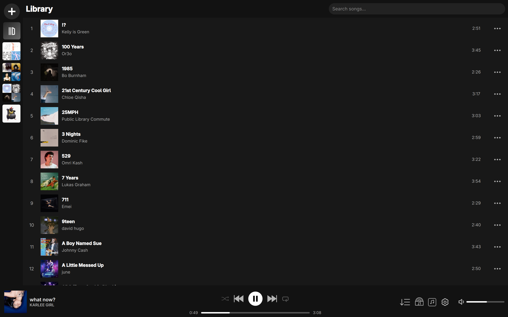
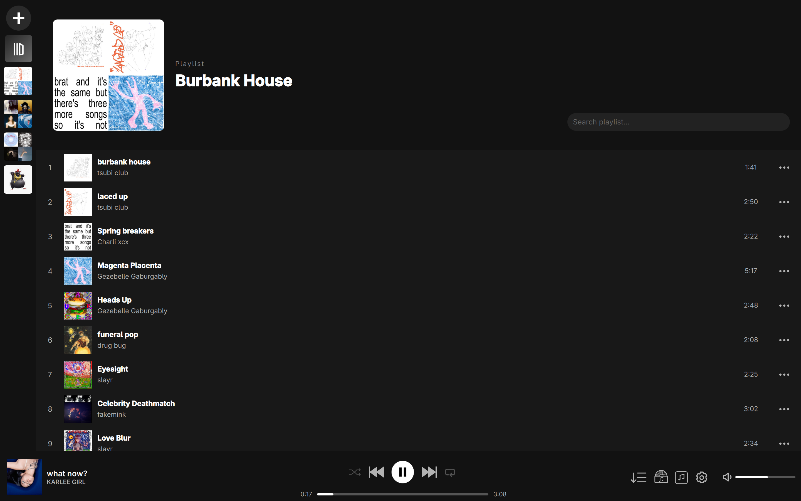
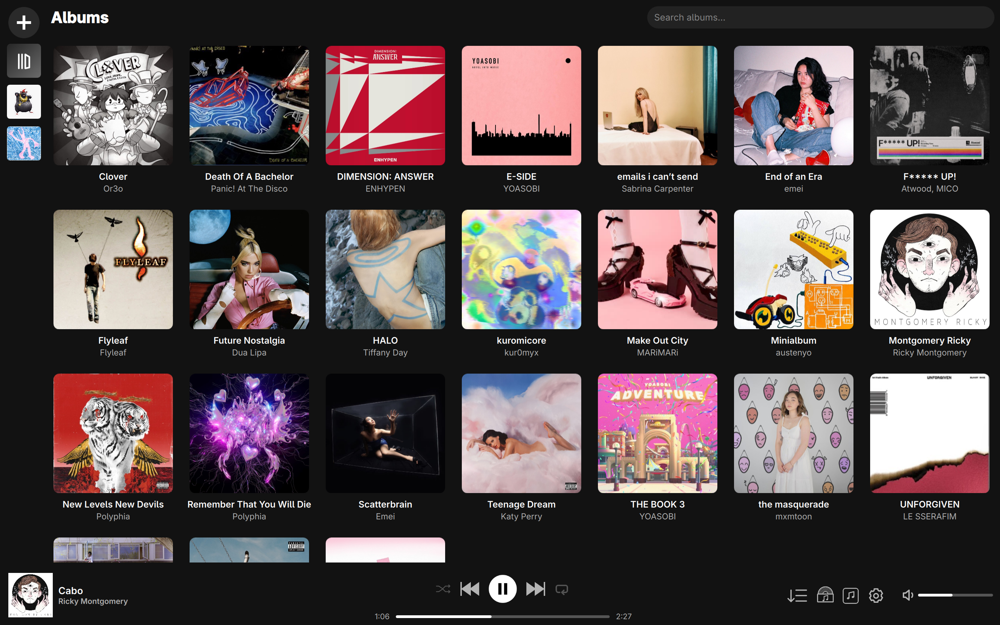

# Meloville

**A music player built for people who just want to listen to their music.**

## Screenshots

### Big Picture Mode



### Music Library



### Playlists




### Albums




## Features

* Native Linux support
    * <small>I literally don't have access to a machine running Windows or MacOS</small>
* Support for mp3, flac, m4a, and ogg files
* Bluetooth headphone playback support
* In-built metadata editor for songs
* Drag and drop songs to switch songs in playlists
    * <small>Suprisingly a lot of other local music players don't have this</small>
* A "Big Picture" mode to see song covers in fullscreen
* Svg based UI assets so it looks great even on on high DPI monitors
* A "listen along" feature where you can open a mini server and stream your current playing song to friends
    * <small>This requires port forwarding if your listener isn't on the same wifi network as you, but as a pro it only requires them to have a browser and an internet connection.</small>
* A playlist and album system that is based on song titles and artists, not filenames, so even renaming files or switching them to different will keep your playlists and albums perfectly intact.
* Smart album sorting where even if a song has "Artist feat Other Artist" it will still correctly be sorted into the album from "Artist"
    * <small>May seem obvious but for songs that have the same album name, differentiating them is something often mislooked from other applications, especially if you don't have a database to check against</small>
* Synced Lyrics Support
    * <small>Only works with .lrc files and must be the same name as music file. Just have the .lrc be somewhere in the music folder and it will automatically find it on relaunch.</small>

## Features That I Am Currently Working On

* Making auto-generated covers for playlists based on song covers
* Packages for arch and maybe a flatpak

## Getting Started

### Prerequisites

You'll need:

* **CMake 3.16+**
* **Qt 6**
* **TagLib**
* **PulseAudio**

### Clone the repository

```bash
git clone https://github.com/NevPeth/meloville
cd meloville
```

### Build

```bash
mkdir build
cd build
cmake ../src && cmake --build .
```

### Run

```bash
./Meloville
```

## Contributing

Contributions are welcome!
Just let me know what was changed in the commit.
AI assissted contributions are allowed but if it is blatantly vibe-coded then it's getting rejected.

## Issues & Suggestions

For now there is no format.
Any issues can be sent without worrying about me being condescending like some other projects.
Just write your issue and I will help you to the best of my ability.
I want this project to last a long, long time.

## License

Meloville is released under the **GNU General Public License v3.0**.
Basically as long as you're making an open source project, use it as you wish.

## Support the Project

If you find Meloville useful, consider giving the project a star on GitHub.